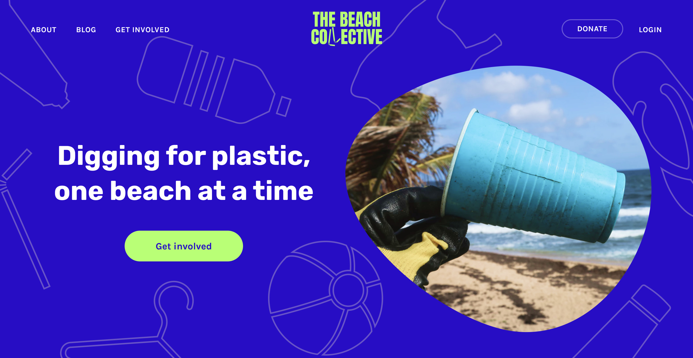

# The Beach Collective - SuperHi

This is a frontend implementation to the Beach Collective from the course [Visual Design + Branding](https://www.superhi.com/courses/visual-design-and-branding) from SuperHi.

## Table of contents

- [Overview](#overview)
  - [The challenge](#the-challenge)
  - [Screenshot](#screenshot)
  - [Links](#links)
- [My process](#my-process)
  - [Built with](#built-with)
  - [What I learned](#what-i-learned)
- [Author](#author)
- [Acknowledgments](#acknowledgments)

## Overview

### The challenge

Users should be able to:

- View the optimal layout for the site depending on their device's screen size
- See hover states for all interactive elements on the page

### Screenshot



### Links

- [Live Site URL](https://hungry-raman-5cd3e9.netlify.app/)

## My process

### Built with

- Semantic HTML5 markup
- CSS custom properties
- Flexbox
- CSS Grid
- Mobile-first workflow
- [Astro](https://docs.astro.build/en/getting-started/) - static site builder

### What I learned

- Importing background Images from Figma and using background-image property instead of position everything absolutely (See [Hero](https://hungry-raman-5cd3e9.netlify.app/) Background)

```scss
section {
  min-height: calc(100vh);
  position: relative;
  background-image: url("/assets/images/mobile/hero_sm.jpg");
  background-size: cover;

  @media (--md) {
    min-height: 46.5rem;
    background-image: url("/assets/images/background.svg");
    background-size: cover;
  }
}
```

- Don't use numbers (type:number) for grid-area-templates! 🥲 Instead use strings (See Facts.astro)

```scss
.fact_wrapper {
  display: grid;
  gap: 1rem;
  grid-template-areas:
    "eins eins"
    "zwei drei"
    "sechs sechs"
    "vier fuenf";
  grid-template-columns: repeat(2, 1fr);
  grid-auto-rows: 1fr;
  @media (--md) {
    grid-template-areas:
      "eins zwei drei"
      "vier fuenf sechs";
    grid-template-columns: repeat(3, 1fr);
  }
}
@each $index, $name in (1, 2, 3, 4, 5, 6), (eins, zwei, drei, vier, fuenf, sechs)
{
  .card_$(index) {
    grid-area: $(name);
  }
}
```

- To have equal height in a grid use grid-auto-rows: 1fr (See )

```scss
display: grid;
grid-template-columns: repeat(2, 1fr);
grid-auto-rows: 1fr;
```

## Author

- [52 Weeks 52 Websites](https://www.minhkhangtran.com/)
- [Twitter](https://twitter.com/devLifting_)
- [Github](https://github.com/MinhKhangTran)

## Acknowledgments

- [Visual Design + Branding](https://www.superhi.com/courses/visual-design-and-branding) from SuperHi.
